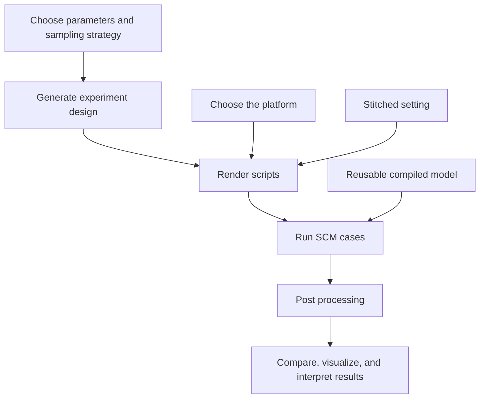

# SCM-UQ Workflow

Workflow tools for ARM97 E3SM single-column model uncertainty quantification experiments. This repository contains the code, templates, configuration, and documentation needed to regenerate designs, render E3SM case scripts, launch runs, postprocess outputs, run QC, and build figures.

## Install

Python dependencies:

```sh
python3 -m pip install -r requirements.txt
```

or with conda:

```sh
conda env create -f environment.yml
conda activate scm-uq-workflow
```


## Configure

Copy the environment example and set paths for your machine:

```sh
cp configs/env.example .env
source .env
```

<!-- 
Important variables:

- `SCM_RUNS` - directory containing E3SM SCM case directories.
- `E3SM_CODE_DIR` - E3SM source checkout used by generated case scripts.
- `ARM97_IOP_FILE` - ARM97 IOP forcing/observation NetCDF file.
- `SCM_BASELINE_HISTORY_FILE` - baseline EAM history NetCDF used by
  comparison and plotting tools.
- `TEMPLATE_EXE` - optional pre-built E3SM executable for reuse-build workflows.
- `TEMPLATE_EXE_MAC` - optional Mac-specific pre-built executable.
- `TEMPLATE_EXE_NERSC` - optional NERSC-specific pre-built executable.
- `SCM_UQ_EXTRA_PATH` - optional compiler/runtime binary path additions.

The reused executable is platform-specific. The repository-local Mac baseline
executable is a macOS arm64 binary and can speed up Mac runs, but it cannot run
on NERSC Linux nodes. For NERSC, build or keep a separate baseline executable on
NERSC and point `TEMPLATE_EXE_NERSC` or `TEMPLATE_EXE` at that file. The current
NERSC reusable ARM97 baseline is:

```sh
export TEMPLATE_EXE_NERSC="/pscratch/sd/y/yunlong/SCM_runs/nersc_ARM97_reusable_baseline/build/e3sm.exe"
``` -->

## Workflow Diagram

This diagram is the canonical workflow for the rebuild. The reusable compiled
model path is optional and can be added later without changing the main stages.
See `docs/ARM97_WORKFLOW_GUIDE.md` for the detailed file-by-file workflow guide.



## Minimal Demo: Run ARM97 Script

This is the smallest useful run for validating the local E3SM/SCM setup before
generating UQ designs. It runs one ARM97 case directly from the case C-shell
script and keeps the demo artifacts under one `cases/` directory.

1. Configure local paths:

```sh
cp configs/env.example .env
source .env
```

At this stage, only these variables are required:

```sh
export SCM_RUNS="/Users/yunlong/projects/e3sm/SCM_runs"
export E3SM_CODE_DIR="/Users/yunlong/projects/e3sm/E3SM"
export SCM_UQ_EXTRA_PATH="/Users/yunlong/local/gcc11/bin:/usr/bin:/bin:/usr/sbin:/sbin:/opt/homebrew/bin:/opt/anaconda3/bin"
```

2. Make the ARM97 IOP file available to E3SM inputdata.

The baseline script expects the forcing file name:

```text
ARM97_iopfile_4scam.nc
```

The file should be available under the E3SM inputdata SCM IOP directory used by
the case:

```text
atm/cam/scam/iop/ARM97_iopfile_4scam.nc
```

3. Choose the local demo case folder and run the case script from the repository
   root:

```sh
CASE_DIR="cases/run_e3sm_scm_ARM97"
./"$CASE_DIR/run_e3sm_scm_ARM97.csh"
```

The script creates, configures, builds, and runs this case:

```text
$SCM_RUNS/e3sm_scm_ARM97
```

Internally it calls the standard CIME steps:

```text
create_newcase
case.setup
case.build
case.submit --no-batch
```

4. Check for the model history output:

```sh
ls "$SCM_RUNS/e3sm_scm_ARM97/run"/*.eam.h0.*.nc
```

5. Post-process the model and observation files into ready-to-visualize NetCDF
   files.

This step keeps post-processing outside Python plotting code. It copies the
model history file into the demo case folder and slices the ARM97 IOP
observation file to the model comparison window.

```sh
CASE_DIR="cases/run_e3sm_scm_ARM97"
mkdir -p "$CASE_DIR"

MODEL_HISTORY="$(ls -t "$SCM_RUNS/e3sm_scm_ARM97/run"/*.eam.h0.*.nc | head -n 1)"
NCKS="${NCKS:-ncks}"

"$NCKS" -O "$MODEL_HISTORY" "$CASE_DIR/arm97_model_ready.nc"
"$NCKS" -O -d time,72,1944 \
  scripts_baseline/ARM97_iopfile_4scam.nc \
  "$CASE_DIR/arm97_iop_observation_model_window_nco.nc"
```

Expected post-processed files:

```text
cases/run_e3sm_scm_ARM97/arm97_model_ready.nc
cases/run_e3sm_scm_ARM97/arm97_iop_observation_model_window_nco.nc
```

If `ncks` is not on `PATH`, install NCO first or point `NCKS` to the local NCO
binary:

```sh
export NCKS="/private/tmp/scm-uq-nco/bin/ncks"
```

6. Visualize the baseline against the IOP observation.

Open the comparison notebook stored with the case artifacts:

```sh
jupyter notebook cases/run_e3sm_scm_ARM97/ARM97_model_output_vs_observation_all_variables.ipynb
```

In the first code cell, make sure the model and observation inputs point to the
case-local post-processed files:

```python
CASE_DIR = ROOT / "cases/run_e3sm_scm_ARM97"
MODEL_FILE = CASE_DIR / "arm97_model_ready.nc"
OBSERVATION_FILE = CASE_DIR / "arm97_iop_observation_model_window_nco.nc"
```

Then run all cells. The notebook produces interactive figures and static output
files under `cases/run_e3sm_scm_ARM97/notebook_outputs/`.

## Demo 2: Run ARM97 Baseline with Stitched Setting

This demo uses the workflow generator instead of the hand-written baseline
script. It creates one baseline sample, renders segmented ARM97 scripts, runs
the segment cases, and stitches the kept windows into one ready-to-analyze
26-day NetCDF file.

1. Configure local paths:

```sh
source .env
```

2. Generate the stitched baseline experiment:

```sh
python3 src/workflows/generate_arm97_experiment.py \
  --platform mac \
  --experiment arm97_baseline_stitched_demo \
  --design baseline \
  --params configs/params_arm97_core.yaml \
  --segment-mode 52x1.5day \
  --out-root arm97_experiments \
  --case-prefix mac_ARM97_baseline_stitched \
  --overwrite
```

The generated files are written under:

```text
arm97_experiments/arm97_baseline_stitched_demo/mac/
```

Key files:

```text
design/arm97_baseline_stitched_demo_samples.csv
design/arm97_baseline_stitched_demo_script_manifest.csv
scripts/*.csh
```

3. Run the generated segment scripts:

```sh
MANIFEST="arm97_experiments/arm97_baseline_stitched_demo/mac/design/arm97_baseline_stitched_demo_script_manifest.csv" \
STATUS="arm97_experiments/arm97_baseline_stitched_demo/mac/design/experiment_run_status.csv" \
MAX_JOBS=10 \
./src/workflows/run_arm97_experiment_segments_parallel.zsh
```

`MAX_JOBS` controls how many segment cases are submitted in parallel. Reduce it
if the machine runs out of memory or compiler/runtime resources.

4. Stitch the segment outputs and extract summary metrics:

```sh
python3 src/workflows/postprocess_arm97_experiment.py \
  --experiment-dir arm97_experiments/arm97_baseline_stitched_demo/mac \
  --manifest arm97_experiments/arm97_baseline_stitched_demo/mac/design/arm97_baseline_stitched_demo_script_manifest.csv \
  --samples arm97_experiments/arm97_baseline_stitched_demo/mac/design/arm97_baseline_stitched_demo_samples.csv \
  --status arm97_experiments/arm97_baseline_stitched_demo/mac/design/experiment_run_status.csv \
  --scm-runs "$SCM_RUNS" \
  --stitch-backend nco
```

The NCO backend uses `ncks` to slice each segment by `time` index and `ncrcat`
to concatenate along the record dimension. If these tools are not on `PATH`,
set `NCKS` and `NCRCAT`, or pass `--ncks /path/to/ncks --ncrcat /path/to/ncrcat`.

Expected stitched output:

```text
arm97_experiments/arm97_baseline_stitched_demo/mac/stitched/mac_ARM97_baseline_stitched_000_stitched_26day.nc
```

Expected metrics outputs:

```text
arm97_experiments/arm97_baseline_stitched_demo/mac/metrics/
```

5. Check the generated products:

```sh
ls -lh arm97_experiments/arm97_baseline_stitched_demo/mac/stitched/*.nc
sed -n '1,5p' arm97_experiments/arm97_baseline_stitched_demo/mac/metrics/*_metrics.csv
```

Notes:

- `--segment-mode 52x1.5day` is the stitched setting exposed by the current
  generator. In the current implementation it renders overlapping 36-hour
  segment runs, discards the first 12 hours of each segment, and keeps the next
  24 hours for stitching.
- Post processing is required for stitched experiments because the model output
  is first produced as separate segment history files.
- If a previous run already created case directories with the same
  `--case-prefix`, choose a new prefix or clean those old case directories
  deliberately before rerunning.

## Demo 3: Run ARM97 QMC Design

This demo generates a QMC parameter design for ARM97 and renders one full
26-day ARM97 script per QMC sample. The QMC parameter set is stored in:

```text
configs/params_arm97_qmc_ppe.yaml
```

The parameters and ranges in that file come from the PPE tuning-parameter table.

1. Configure local paths:

```sh
source .env
```

2. Generate the QMC design.

This example generates 8 DigitalNetB2 QMC samples. With `--segment-mode
full26day`, each sample is rendered as one full 26-day ARM97 script:

```sh
python3 src/workflows/generate_arm97_experiment.py \
  --platform mac \
  --experiment ARM97_qmc \
  --design digitalnetb2 \
  --n-samples 8 \
  --seed 20260428 \
  --params configs/params_arm97_qmc_ppe.yaml \
  --template src/workflows/MAC_ARM97_implicit_stress_baseline.csh \
  --segment-mode full26day \
  --out-root cases/run_e3sm_scm_ARM97_qmc \
  --output-layout case-dir \
  --case-prefix run_e3sm_scm_ARM97_qmc \
  --overwrite
```

Expected output:

```text
cases/run_e3sm_scm_ARM97_qmc/ARM97_qmc_samples.csv
cases/run_e3sm_scm_ARM97_qmc/scripts/ARM97_qmc_script_manifest.csv
cases/run_e3sm_scm_ARM97_qmc/scripts/*.csh
```

The samples CSV records the sampler, seed, sample index, formatted namelist
values, and numeric parameter values used for analysis. With `--n-samples 8`
and `--segment-mode full26day`, the generator writes 8 full-run scripts.

3. Run the generated QMC scripts:

```sh
MANIFEST="cases/run_e3sm_scm_ARM97_qmc/scripts/ARM97_qmc_script_manifest.csv" \
STATUS="cases/run_e3sm_scm_ARM97_qmc/scripts/experiment_run_status.csv" \
MAX_JOBS=10 \
./src/workflows/run_arm97_experiment_segments_parallel.zsh
```

Tune `MAX_JOBS` for the local machine before running larger QMC designs.

4. Post-process the QMC outputs and extract metrics:

```sh
python3 src/workflows/postprocess_arm97_experiment.py \
  --experiment-dir cases/run_e3sm_scm_ARM97_qmc \
  --manifest cases/run_e3sm_scm_ARM97_qmc/scripts/ARM97_qmc_script_manifest.csv \
  --samples cases/run_e3sm_scm_ARM97_qmc/ARM97_qmc_samples.csv \
  --status cases/run_e3sm_scm_ARM97_qmc/scripts/experiment_run_status.csv \
  --scm-runs "$SCM_RUNS"
```

Expected post-processed products:

```text
cases/run_e3sm_scm_ARM97_qmc/output/ARM97_qmc_*.nc
cases/run_e3sm_scm_ARM97_qmc/metrics/
```

## Demo 4: ARM97 ML Trigger

This demo runs one Mac ARM97 baseline case with the ML4ESM embedded CNN trigger
enabled. It uses the current baseline physics configuration: EAM master-style
`nlev 80`, prescribed aerosol, COSP enabled, and `PRECT` history output.

The ML trigger path is Mac-only in this repository. Unlike the reusable
executable workflow, this case builds a fresh E3SM executable after installing
the ML4ESM `SourceMods` and Python bridge into the generated case.

1. Configure local paths and ML4ESM settings:

```sh
source .env

export SCM_RUNS="/Users/yunlong/projects/e3sm/SCM_runs"
export E3SM_CODE_DIR="/Users/yunlong/projects/e3sm/E3SM"
export SCM_UQ_EXTRA_PATH="/Users/yunlong/local/gcc11/bin:/usr/bin:/bin:/usr/sbin:/sbin:/opt/homebrew/bin:/opt/anaconda3/bin"

export ML4ESM_DIR="/Users/yunlong/Workshop/ML4ESM"
export ML4ESM_PYTHON_BIN="/Users/yunlong/miniconda3/bin/python"
```

1. Generate one full 26-day ARM97 ML-trigger script:

```sh
python3 src/workflows/generate_arm97_experiment.py \
  --platform mac \
  --experiment arm97_ml_trigger_demo \
  --design baseline \
  --params configs/params_arm97_core.yaml \
  --segment-mode full26day \
  --enable-ml4esm \
  --out-root arm97_experiments \
  --case-prefix mac_ARM97_ml_trigger \
  --overwrite
```

Expected generated files:

```text
arm97_experiments/arm97_ml_trigger_demo/mac/design/arm97_ml_trigger_demo_samples.csv
arm97_experiments/arm97_ml_trigger_demo/mac/design/arm97_ml_trigger_demo_script_manifest.csv
arm97_experiments/arm97_ml_trigger_demo/mac/scripts/mac_ARM97_ml_trigger_000.csh
```

3. Run the generated ML case:

```sh
arm97_experiments/arm97_ml_trigger_demo/mac/scripts/mac_ARM97_ml_trigger_000.csh
```

The script creates and runs this case:

```text
$SCM_RUNS/mac_ARM97_ml_trigger_000
```

Internally, when `ENABLE_ML4ESM=true`, the script:

- copies `$ML4ESM_DIR/SourceMods/src.eam` into the case `SourceMods`;
- verifies `ML4ESM_PYTHON_BIN` can import `numpy` and `torch`;
- appends Python include and linker flags to `cmake_macros/gnu11_Mac.cmake`;
- writes `ML4ESM_MODEL_DIR`, `ML4ESM_PYTHONHOME`, `ML4ESM_PYTHONPATH`, and
  `DYLD_LIBRARY_PATH` into the case machine environment files;
- runs `case.build` and `case.submit --no-batch`.

4. Check the model output:

```sh
ls "$SCM_RUNS/mac_ARM97_ml_trigger_000/run"/*.eam.h0.*.nc
```

Notes:

- Keep `--segment-mode full26day` for this demo so only one ML-enabled case is
  built and run.
- `--enable-ml4esm` writes `setenv ENABLE_ML4ESM true` into the generated
  `.csh` script, so the run does not depend on exporting that variable in the
  shell.
- This demo currently targets Mac only; NERSC ML-trigger support has not been
  wired into the workflow templates.

## Demo 5: Run ARM97 QMC with Stitched Setting

This demo generates and runs 64 ARM97 DigitalNetB2 QMC members using the
stitched setting recommended for model evaluation. It reuses one compatible
Mac `e3sm.exe` for every segment instead of compiling E3SM 1,664 times. No
baseline member is generated; use the stitched baseline from Demo 2 if a
default-run comparison is needed.

The active E3SMv3/P3 parameter set is stored in:

```text
configs/params_arm97_e3smv3_qmc_ppe_active.yaml
```

It contains 27 perturbed parameters after excluding `zmconv_c0_lnd`,
`zmconv_c0_ocn`, `ice_sed_ai`, and `cloud_reffi_zmdetr`. The last parameter was
not present in the runnable source YAML, ARM97 template, or local E3SM namelist.

Each QMC member contains 26 independent 36-hour segments. The first 12 hours of
each segment are discarded as spin-up and the following 24 hours are retained,
producing one continuous 26-day stitched output per member.

1. Configure the local paths and select the reusable executable:

```sh
source .env

export TEMPLATE_EXE_MAC="/Users/yunlong/projects/e3sm/SCM_runs/run_e3sm_scm_ARM97_qmc64_0708_000/build/e3sm.exe"
test -x "$TEMPLATE_EXE_MAC"
```

The executable above was built with the same 0708 ARM97 configuration used by
this demo. Reuse is appropriate because all 27 perturbations are EAM namelist
parameters, not compile-time options. Use a freshly built executable instead
if the E3SM source, machine architecture, compiler libraries, grid, number of
levels, P3/COSP configuration, or `SourceMods` have changed. In particular, an
ML4ESM executable must not be substituted for this non-ML experiment.

Demo 5 uses `scripts_baseline/run_e3sm_scm_ARM97_0713.csh`, which preserves the
0708 ARM97 namelist and output configuration while adding executable reuse.
When `TEMPLATE_EXE_MAC` (or the fallback `TEMPLATE_EXE`) is set, the 0713
template copies that executable into each case and marks the build complete.
If neither variable is set, it runs `case.build`. The original 0708 template is
kept unchanged and always builds a fresh executable.

2. Regenerate the 64-member stitched QMC experiment:

```sh
python3 src/workflows/generate_arm97_experiment.py \
  --platform mac \
  --experiment arm97_qmc64_stitched_demo \
  --design digitalnetb2 \
  --n-samples 64 \
  --seed 20260709 \
  --params configs/params_arm97_e3smv3_qmc_ppe_active.yaml \
  --template scripts_baseline/run_e3sm_scm_ARM97_0713.csh \
  --segment-mode 52x1.5day \
  --out-root cases \
  --case-prefix run_ARM97_qmc64_stitched_0713 \
  --overwrite
```

The generated experiment is written under:

```text
cases/arm97_qmc64_stitched_demo/mac/
```

Rerun this command even if the scripts were generated previously: scripts
created before executable reuse was enabled still contain the old template and
will call `case.build`. `--overwrite` replaces generated scripts but does not
remove existing case directories under `$SCM_RUNS`.

The command generates samples 0 through 63, all from DigitalNetB2. Each sample
has 26 segment scripts, for 1,664 scripts in total. There is no
`sample_kind=baseline` row because `--include-baseline` is intentionally not
used.

3. Check the generated design before starting the model runs:

```sh
EXPERIMENT_DIR="cases/arm97_qmc64_stitched_demo/mac"
SAMPLES="$EXPERIMENT_DIR/design/arm97_qmc64_stitched_demo_samples.csv"
MANIFEST="$EXPERIMENT_DIR/design/arm97_qmc64_stitched_demo_script_manifest.csv"

tail -n +2 "$SAMPLES" | wc -l
tail -n +2 "$MANIFEST" | wc -l
find "$EXPERIMENT_DIR/scripts" -type f -name '*.csh' | wc -l
cut -d, -f8 "$SAMPLES" | tail -n +2 | grep -cx baseline || true
grep -l 'TEMPLATE_EXE_MAC' "$EXPERIMENT_DIR"/scripts/*.csh | wc -l
```

The expected counts are 64 sample rows, 1,664 manifest rows, and 1,664 C-shell
scripts. The baseline match count must be zero, and all 1,664 scripts should
contain the executable-reuse branch. Generated case names range from:

```text
run_ARM97_qmc64_stitched_0713_000_seg_000
run_ARM97_qmc64_stitched_0713_063_seg_025
```

4. Run the generated segment scripts:

```sh
MANIFEST="cases/arm97_qmc64_stitched_demo/mac/design/arm97_qmc64_stitched_demo_script_manifest.csv" \
STATUS="cases/arm97_qmc64_stitched_demo/mac/design/experiment_run_status.csv" \
MAX_JOBS=10 \
./src/workflows/run_arm97_experiment_segments_parallel.zsh
```

`MAX_JOBS` controls the number of segment cases run concurrently within each
sample. Reduce it if the Mac runs out of memory or compiler/runtime resources.
The runner records every attempted case in the status CSV. A recorded failed
case is not automatically retried; resolve its error and deliberately handle
the old case directory and retry status before rerunning it. Reusing the
executable avoids roughly two minutes of compilation per segment; a practical
estimate for the complete experiment with `MAX_JOBS=10` is about 1--3 hours,
although case setup, disk I/O, and available memory can change this substantially.

5. Stitch the segment outputs and extract metrics:

```sh
python3 src/workflows/postprocess_arm97_experiment.py \
  --experiment-dir cases/arm97_qmc64_stitched_demo/mac \
  --manifest cases/arm97_qmc64_stitched_demo/mac/design/arm97_qmc64_stitched_demo_script_manifest.csv \
  --samples cases/arm97_qmc64_stitched_demo/mac/design/arm97_qmc64_stitched_demo_samples.csv \
  --status cases/arm97_qmc64_stitched_demo/mac/design/experiment_run_status.csv \
  --scm-runs "$SCM_RUNS" \
  --stitch-backend nco
```

The NCO backend requires `ncks` and `ncrcat` on `PATH`. Set `NCKS` and
`NCRCAT`, or pass `--ncks` and `--ncrcat`, if they are installed elsewhere.

6. Check the stitched products and metrics:

```sh
EXPERIMENT_DIR="cases/arm97_qmc64_stitched_demo/mac"

find "$EXPERIMENT_DIR/stitched" -type f -name '*_stitched_26day.nc' | wc -l
ls -lh "$EXPERIMENT_DIR/stitched"/run_ARM97_qmc64_stitched_0713_*_stitched_26day.nc
ls -lh "$EXPERIMENT_DIR/metrics"/arm97_qmc64_stitched_demo_mac_metrics.csv
ls -lh "$EXPERIMENT_DIR/metrics"/arm97_qmc64_stitched_demo_mac_parameter_response.csv
```

The expected stitched count is 64. Each output is named
`run_ARM97_qmc64_stitched_0713_<sample>_stitched_26day.nc`.

Notes:

- Despite the CLI name `52x1.5day`, the current implementation renders 26 daily
  segment cases per sample for the 26-day ARM97 window.
- Existing case directories can block reruns and should only be renamed or
  removed deliberately.
- This is a production-size experiment: 64 samples times 26 segments equals
  1,664 SCM cases.

## License

This workflow code is released under the MIT License. See `LICENSE`.
