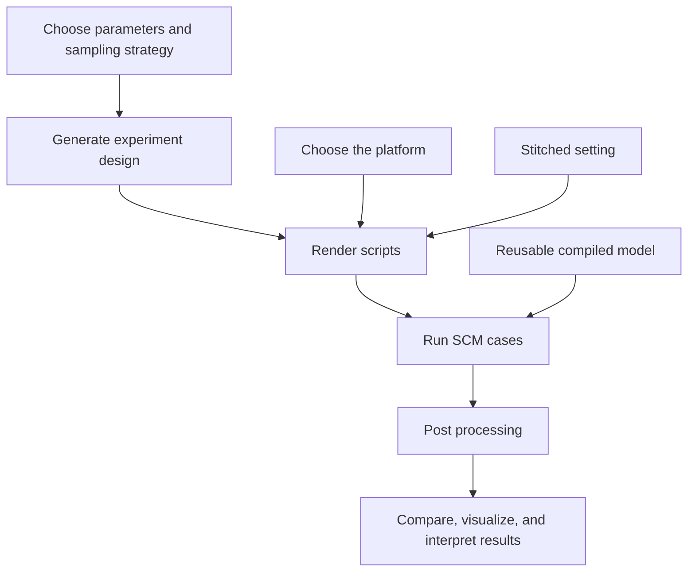

# SCM-UQ Workflow

Workflow tools for ARM97 E3SM single-column model uncertainty quantification experiments. This repository contains the code, templates, configuration, and documentation needed to regenerate designs, render E3SM case scripts, launch runs, postprocess outputs, run QC, and build figures.

## Install

Python dependencies:

```sh
python3 -m pip install -r requirements.txt
```

or with conda:

```sh
conda env create -f environment.yml
conda activate scm-uq-workflow
```


## Configure

Copy the environment example and set paths for your machine:

```sh
cp configs/env.example .env
source .env
```

<!-- 
Important variables:

- `SCM_RUNS` - directory containing E3SM SCM case directories.
- `E3SM_CODE_DIR` - E3SM source checkout used by generated case scripts.
- `ARM97_IOP_FILE` - ARM97 IOP forcing/observation NetCDF file.
- `SCM_BASELINE_HISTORY_FILE` - baseline EAM history NetCDF used by
  comparison and plotting tools.
- `TEMPLATE_EXE` - optional pre-built E3SM executable for reuse-build workflows.
- `TEMPLATE_EXE_MAC` - optional Mac-specific pre-built executable.
- `TEMPLATE_EXE_NERSC` - optional NERSC-specific pre-built executable.
- `SCM_UQ_EXTRA_PATH` - optional compiler/runtime binary path additions.

The reused executable is platform-specific. The repository-local Mac baseline
executable is a macOS arm64 binary and can speed up Mac runs, but it cannot run
on NERSC Linux nodes. For NERSC, build or keep a separate baseline executable on
NERSC and point `TEMPLATE_EXE_NERSC` or `TEMPLATE_EXE` at that file. The current
NERSC reusable ARM97 baseline is:

```sh
export TEMPLATE_EXE_NERSC="/pscratch/sd/y/yunlong/SCM_runs/nersc_ARM97_reusable_baseline/build/e3sm.exe"
``` -->

## Workflow Diagram

This diagram is the canonical workflow for the rebuild. The reusable compiled
model path is optional and can be added later without changing the main stages.
See `docs/ARM97_WORKFLOW_GUIDE.md` for the detailed file-by-file workflow guide.



## Minimal Demo: Run ARM97 Script

This is the smallest useful run for validating the local E3SM/SCM setup before
generating UQ designs. It runs one ARM97 case directly from the case C-shell
script and keeps the demo artifacts under one `cases/` directory.

1. Configure local paths:

```sh
cp configs/env.example .env
source .env
```

At this stage, only these variables are required:

```sh
export SCM_RUNS="/Users/yunlong/projects/e3sm/SCM_runs"
export E3SM_CODE_DIR="/Users/yunlong/projects/e3sm/E3SM"
export SCM_UQ_EXTRA_PATH="/Users/yunlong/local/gcc11/bin:/usr/bin:/bin:/usr/sbin:/sbin:/opt/homebrew/bin:/opt/anaconda3/bin"
```

2. Make the ARM97 IOP file available to E3SM inputdata.

The baseline script expects the forcing file name:

```text
ARM97_iopfile_4scam.nc
```

The file should be available under the E3SM inputdata SCM IOP directory used by
the case:

```text
atm/cam/scam/iop/ARM97_iopfile_4scam.nc
```

3. Choose the local demo case folder and run the case script from the repository
   root:

```sh
CASE_DIR="cases/run_e3sm_scm_ARM97"
./"$CASE_DIR/run_e3sm_scm_ARM97.csh"
```

The script creates, configures, builds, and runs this case:

```text
$SCM_RUNS/e3sm_scm_ARM97
```

Internally it calls the standard CIME steps:

```text
create_newcase
case.setup
case.build
case.submit --no-batch
```

4. Check for the model history output:

```sh
ls "$SCM_RUNS/e3sm_scm_ARM97/run"/*.eam.h0.*.nc
```

5. Post-process the model and observation files into ready-to-visualize NetCDF
   files.

This step keeps post-processing outside Python plotting code. It copies the
model history file into the demo case folder and slices the ARM97 IOP
observation file to the model comparison window.

```sh
CASE_DIR="cases/run_e3sm_scm_ARM97"
mkdir -p "$CASE_DIR"

MODEL_HISTORY="$(ls -t "$SCM_RUNS/e3sm_scm_ARM97/run"/*.eam.h0.*.nc | head -n 1)"
NCKS="${NCKS:-ncks}"

"$NCKS" -O "$MODEL_HISTORY" "$CASE_DIR/arm97_model_ready.nc"
"$NCKS" -O -d time,72,1944 \
  scripts_baseline/ARM97_iopfile_4scam.nc \
  "$CASE_DIR/arm97_iop_observation_model_window_nco.nc"
```

Expected post-processed files:

```text
cases/run_e3sm_scm_ARM97/arm97_model_ready.nc
cases/run_e3sm_scm_ARM97/arm97_iop_observation_model_window_nco.nc
```

If `ncks` is not on `PATH`, install NCO first or point `NCKS` to the local NCO
binary:

```sh
export NCKS="/private/tmp/scm-uq-nco/bin/ncks"
```

6. Visualize the baseline against the IOP observation.

Open the comparison notebook stored with the case artifacts:

```sh
jupyter notebook cases/run_e3sm_scm_ARM97/ARM97_model_output_vs_observation_all_variables.ipynb
```

In the first code cell, make sure the model and observation inputs point to the
case-local post-processed files:

```python
CASE_DIR = ROOT / "cases/run_e3sm_scm_ARM97"
MODEL_FILE = CASE_DIR / "arm97_model_ready.nc"
OBSERVATION_FILE = CASE_DIR / "arm97_iop_observation_model_window_nco.nc"
```

Then run all cells. The notebook produces interactive figures and static output
files under `cases/run_e3sm_scm_ARM97/notebook_outputs/`.

## Demo 2: Run ARM97 Baseline with Stitched Setting

This demo uses the workflow generator instead of the hand-written baseline
script. It creates one baseline sample, renders segmented ARM97 scripts, runs
the segment cases, and stitches the kept windows into one ready-to-analyze
26-day NetCDF file.

1. Configure local paths:

```sh
source .env
```

2. Generate the stitched baseline experiment:

```sh
python3 src/workflows/generate_arm97_experiment.py \
  --platform mac \
  --experiment arm97_baseline_stitched_demo \
  --design baseline \
  --params configs/params_arm97_core.yaml \
  --segment-mode 52x1.5day \
  --out-root arm97_experiments \
  --case-prefix mac_ARM97_baseline_stitched \
  --overwrite
```

The generated files are written under:

```text
arm97_experiments/arm97_baseline_stitched_demo/mac/
```

Key files:

```text
design/arm97_baseline_stitched_demo_samples.csv
design/arm97_baseline_stitched_demo_script_manifest.csv
scripts/*.csh
```

3. Run the generated segment scripts:

```sh
MANIFEST="arm97_experiments/arm97_baseline_stitched_demo/mac/design/arm97_baseline_stitched_demo_script_manifest.csv" \
STATUS="arm97_experiments/arm97_baseline_stitched_demo/mac/design/experiment_run_status.csv" \
MAX_JOBS=10 \
./src/workflows/run_arm97_experiment_segments_parallel.zsh
```

`MAX_JOBS` controls how many segment cases are submitted in parallel. Reduce it
if the machine runs out of memory or compiler/runtime resources.

4. Stitch the segment outputs and extract summary metrics:

```sh
python3 src/workflows/postprocess_arm97_experiment.py \
  --experiment-dir arm97_experiments/arm97_baseline_stitched_demo/mac \
  --manifest arm97_experiments/arm97_baseline_stitched_demo/mac/design/arm97_baseline_stitched_demo_script_manifest.csv \
  --samples arm97_experiments/arm97_baseline_stitched_demo/mac/design/arm97_baseline_stitched_demo_samples.csv \
  --status arm97_experiments/arm97_baseline_stitched_demo/mac/design/experiment_run_status.csv \
  --scm-runs "$SCM_RUNS" \
  --stitch-backend nco
```

The NCO backend uses `ncks` to slice each segment by `time` index and `ncrcat`
to concatenate along the record dimension. If these tools are not on `PATH`,
set `NCKS` and `NCRCAT`, or pass `--ncks /path/to/ncks --ncrcat /path/to/ncrcat`.

Expected stitched output:

```text
arm97_experiments/arm97_baseline_stitched_demo/mac/stitched/mac_ARM97_baseline_stitched_000_stitched_26day.nc
```

Expected metrics outputs:

```text
arm97_experiments/arm97_baseline_stitched_demo/mac/metrics/
```

5. Check the generated products:

```sh
ls -lh arm97_experiments/arm97_baseline_stitched_demo/mac/stitched/*.nc
sed -n '1,5p' arm97_experiments/arm97_baseline_stitched_demo/mac/metrics/*_metrics.csv
```

Notes:

- `--segment-mode 52x1.5day` is the stitched setting exposed by the current
  generator. In the current implementation it renders overlapping 36-hour
  segment runs, discards the first 12 hours of each segment, and keeps the next
  24 hours for stitching.
- Post processing is required for stitched experiments because the model output
  is first produced as separate segment history files.
- If a previous run already created case directories with the same
  `--case-prefix`, choose a new prefix or clean those old case directories
  deliberately before rerunning.

## License

This workflow code is released under the MIT License. See `LICENSE`.
