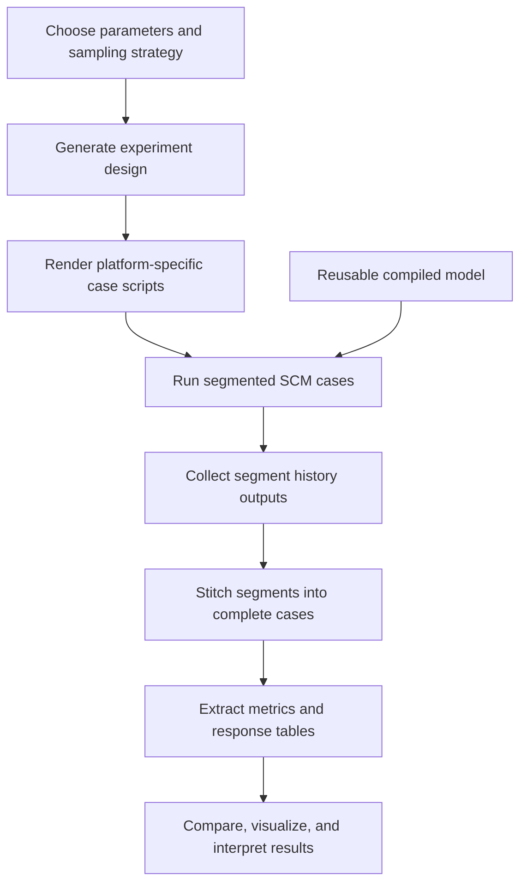

# SCM-UQ Workflow

Workflow tools for ARM97 E3SM single-column model uncertainty quantification
experiments. This repository contains the code, templates, configuration, and
documentation needed to regenerate designs, render E3SM case scripts, launch
runs, postprocess outputs, run QC, and build figures.

It intentionally does not include generated model output, downloaded NetCDF
history files, E3SM source code, or machine-local inputdata.

## Workflow Stages

1. `01-design-generation/` - QMC, OAT, ARM97, and segmented experiment design tools.
2. `02-case-generation/` - tools that render E3SM case scripts and manifests.
3. `03-run-control/` - local Mac and NERSC run orchestration helpers.
4. `04-postprocess-qc/` - stitching, metrics extraction, QC, and sensitivity analysis tools.
5. `05-comparison-visualization/` - comparison and plotting scripts.
6. `templates/` - notes about E3SM template scripts used by generators.
7. `manifests/` - machine-readable tool inventory.

## Install

Python dependencies:

```sh
python3 -m pip install -r requirements.txt
```

or with conda:

```sh
conda env create -f environment.yml
conda activate scm-uq-workflow
```

## Configure

Copy the environment example and set paths for your machine:

```sh
cp examples/env.example .env
source .env
```

Important variables:

- `SCM_RUNS` - directory containing E3SM SCM case directories.
- `E3SM_CODE_DIR` - E3SM source checkout used by generated case scripts.
- `ARM97_IOP_FILE` - ARM97 IOP forcing/observation NetCDF file.
- `SCM_BASELINE_HISTORY_FILE` - baseline EAM history NetCDF used by
  comparison and plotting tools.
- `TEMPLATE_EXE` - optional pre-built E3SM executable for reuse-build workflows.
- `TEMPLATE_EXE_MAC` - optional Mac-specific pre-built executable.
- `TEMPLATE_EXE_NERSC` - optional NERSC-specific pre-built executable.
- `SCM_UQ_EXTRA_PATH` - optional compiler/runtime binary path additions.

The reused executable is platform-specific. The repository-local Mac baseline
executable is a macOS arm64 binary and can speed up Mac runs, but it cannot run
on NERSC Linux nodes. For NERSC, build or keep a separate baseline executable on
NERSC and point `TEMPLATE_EXE_NERSC` or `TEMPLATE_EXE` at that file. The current
NERSC reusable ARM97 baseline is:

```sh
export TEMPLATE_EXE_NERSC="/pscratch/sd/y/yunlong/SCM_runs/nersc_ARM97_reusable_baseline/build/e3sm.exe"
```

## Run

Run commands from this repository root:

```sh
python3 scripts/workflows/generate_arm97_experiment.py --help
python3 scripts/workflows/generate_qmc64_segmented_scripts.py --help
./scripts/workflows/run_arm97_experiment_segments_parallel.zsh
```

The workflow scripts compute the repository root from their own location, but
running from the root keeps relative output paths and logs predictable.

## Workflow Diagram



## Demo: 70-Sample Mac Reuse-Build Run

This demo is the end-to-end Mac workflow used for a 14-parameter,
70-sample ARM97 experiment. It reuses a pre-built Mac `e3sm.exe`, runs the
segmented cases, and stitches each sample into one complete 26-day output file.
It uses:

- 14 PPE tuning parameters from `examples/params_arm97_14.yaml`.
- QMC sampling with `QMCPy DigitalNetB2`.
- Fixed seed `20260602`.
- Stitched mode with 52 overlapping segments per sample.

The parameter YAML maps PPE paper names to E3SM namelist names used by the
templates, for example `dp1 -> cldfrc_dp1`, `dmpdz -> zmconv_dmpdz`,
`gamma_coef -> clubb_gamma_coef`, and `c6rt -> clubb_C6rt`.

Generate the experiment scripts:

```sh
python3 scripts/workflows/generate_arm97_experiment.py \
  --platform mac \
  --experiment arm97_qmc14x5_stitched_seed20260602 \
  --design digitalnetb2 \
  --n-samples 70 \
  --seed 20260602 \
  --params examples/params_arm97_14.yaml \
  --segment-mode 52x1.5day \
  --out-root arm97_experiments_0602 \
  --case-prefix mac_ARM97_qmc14x5 \
  --overwrite
```

Run the 70 samples with a reused executable:

```sh
export SCM_RUNS="/Users/yunlong/projects/e3sm/SCM_runs"
export E3SM_CODE_DIR="/Users/yunlong/projects/e3sm/E3SM"
export SCM_UQ_EXTRA_PATH="/Users/yunlong/local/gcc11/bin:/usr/bin:/bin:/usr/sbin:/sbin:/opt/homebrew/bin:/opt/anaconda3/bin"

MANIFEST="arm97_experiments_0602/arm97_qmc14x5_stitched_seed20260602/mac/design/arm97_qmc14x5_stitched_seed20260602_script_manifest.csv" \
STATUS="arm97_experiments_0602/arm97_qmc14x5_stitched_seed20260602/mac/design/experiment_run_status_all70.csv" \
MAX_JOBS=10 \
./scripts/workflows/run_arm97_experiment_segments_parallel.zsh
```

The run creates `70 * 52 = 3640` segment cases. If a segment already has a
history file, the runner records it as `skipped_existing_success` and continues,
so interrupted or partial runs can be resumed with the same `STATUS` file.

Stitch the 52 segments for each sample into one 26-day file and extract summary
metrics:

```sh
python3 scripts/workflows/postprocess_arm97_experiment.py \
  --experiment-dir arm97_experiments_0602/arm97_qmc14x5_stitched_seed20260602/mac \
  --manifest arm97_experiments_0602/arm97_qmc14x5_stitched_seed20260602/mac/design/arm97_qmc14x5_stitched_seed20260602_script_manifest.csv \
  --samples arm97_experiments_0602/arm97_qmc14x5_stitched_seed20260602/mac/design/arm97_qmc14x5_stitched_seed20260602_samples.csv \
  --status arm97_experiments_0602/arm97_qmc14x5_stitched_seed20260602/mac/design/experiment_run_status_all70.csv \
  --scm-runs "$SCM_RUNS"
```

Expected successful outputs:

```text
arm97_experiments_0602/arm97_qmc14x5_stitched_seed20260602/mac/stitched/*.nc
arm97_experiments_0602/arm97_qmc14x5_stitched_seed20260602/mac/metrics/arm97_qmc14x5_stitched_seed20260602_mac_metrics.csv
arm97_experiments_0602/arm97_qmc14x5_stitched_seed20260602/mac/metrics/arm97_qmc14x5_stitched_seed20260602_mac_parameter_response.csv
```

The completed demo produced:

```text
segment records: 3640 total; 3588 success; 52 skipped_existing_success; 0 failed
stitched files: 70
time records per stitched file: 1249
stitched time range: 1997-06-19 23:29:45 to 1997-07-15 23:29:45
```

In stitched mode, each segment runs for 36 hours. The first 24 hours are
discarded as spinup, and the final 12-hour window is kept. With half-hourly
history output and duplicate boundary times removed, 52 kept windows produce a
complete 26-day sample.

## NERSC Small-Batch Test Before Full Run

Before running the full 70-sample experiment on NERSC, generate a small test
with the same 14-parameter design, sampler, seed, and stitched segment mode.
This example uses 2 samples, so it creates `2 * 52 = 104` segment cases.

Generate the NERSC smoke-test scripts:

```sh
python3 scripts/workflows/generate_arm97_experiment.py \
  --platform nersc \
  --experiment arm97_qmc14x5_nersc_smoke2_seed20260602 \
  --design digitalnetb2 \
  --n-samples 2 \
  --seed 20260602 \
  --params examples/params_arm97_14.yaml \
  --segment-mode 52x1.5day \
  --out-root nersc_experiments_0602 \
  --case-prefix nersc_ARM97_qmc14x5_smoke
```

The generated NERSC run directory is:

```text
nersc_experiments_0602/arm97_qmc14x5_nersc_smoke2_seed20260602/nersc/
```

On NERSC, from that generated directory, set machine-specific paths:

```sh
export SCM_RUNS="${PSCRATCH}/SCM_runs"
export E3SM_CODE_DIR="/path/to/E3SM"
export TEMPLATE_EXE_NERSC="/pscratch/sd/y/yunlong/SCM_runs/nersc_ARM97_reusable_baseline/build/e3sm.exe"
```

Set up the E3SM cases:

```sh
MAX_SETUP_JOBS=8 ./setup_cases_nersc.sh
```

Submit the smoke-test bundle:

```sh
sbatch --export=ALL,MAX_CONCURRENT=104 run_bundle_nersc.sh
```

After the smoke test succeeds, generate the full 70-sample NERSC batch:

```sh
python3 scripts/workflows/generate_arm97_experiment.py \
  --platform nersc \
  --experiment arm97_qmc14x5_nersc_seed20260602 \
  --design digitalnetb2 \
  --n-samples 70 \
  --seed 20260602 \
  --params examples/params_arm97_14.yaml \
  --segment-mode 52x1.5day \
  --out-root nersc_experiments_0602 \
  --case-prefix nersc_ARM97_qmc14x5
```

Then run the full batch from:

```text
nersc_experiments_0602/arm97_qmc14x5_nersc_seed20260602/nersc/
```

For the full run, start with:

```sh
MAX_SETUP_JOBS=8 ./setup_cases_nersc.sh
sbatch --export=ALL,MAX_CONCURRENT=120 run_bundle_nersc.sh
```

The generated `run_bundle_nersc.sh` uses one CPU node, `regular` QOS, and a
4-hour walltime by default. Edit the `#SBATCH --account`, `#SBATCH --time`, and
`MAX_CONCURRENT` settings if your NERSC project or queue behavior requires it.

## Quick Links

- Full tool inventory: `manifests/tools.csv`
- One-page command reference: `00-overview/COMMANDS.md`
- Workflow scripts: `scripts/workflows/`
- GitHub release checklist: `docs/GITHUB_RELEASE_CHECKLIST.md`

## License

This workflow code is released under the MIT License. See `LICENSE`.
